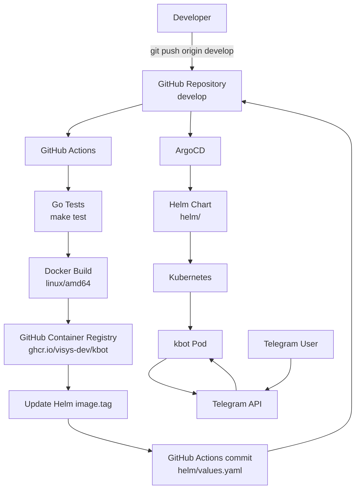

# Kbot

Kbot — Telegram-бот, написаний мовою Go з використанням бібліотек [Telebot](https://github.com/tucnak/telebot) і [Cobra](https://github.com/spf13/cobra).

Бот приймає текстові команди та надсилає відповіді в Telegram.

Під час розробки та тестування використовувався бот [@devops_kbot_bot](https://t.me/devops_kbot_bot).

## CI/CD

Проєкт використовує повністю автоматизований CI/CD pipeline на основі:

- **GitHub Actions** — CI/CD automation;
- **GitHub Container Registry (`ghcr.io`)** — container registry;
- **Docker** — створення container image;
- **Helm** — Kubernetes packaging;
- **ArgoCD** — GitOps deployment;
- **Kubernetes** — runtime infrastructure.

Workflow запускається при `push` у гілку `develop`.

Цільова платформа container image:

```text
OS: linux
Architecture: amd64
```

Container image має формат:

```text
ghcr.io/visys-dev/kbot:<VERSION>-linux-amd64
```

Наприклад:

```text
ghcr.io/visys-dev/kbot:v1.0.2-22-gf490f1f-linux-amd64
```

### CI/CD Workflow



### Workflow sequence

При кожному push основного коду в `develop`:

1. GitHub Actions checkout-ить repository.
2. Виконується тестування Go-коду:

```bash
make test
```

3. На основі Git tag і Git commit формується `VERSION`.

Приклад:

```text
v1.0.2-22-gf490f1f
```

4. GitHub Actions автентифікується в `ghcr.io` через `GITHUB_TOKEN`.

5. Makefile збирає container image:

```bash
make image
```

Формат:

```text
ghcr.io/visys-dev/kbot:${VERSION}-linux-amd64
```

6. Image публікується в GitHub Container Registry:

```bash
make push
```

7. CD job оновлює:

```text
helm/values.yaml
```

і записує новий version tag:

```yaml
image:
  registry: "ghcr.io"
  repository: "visys-dev/kbot"
  tag: "v1.0.2-22-gf490f1f"
  os: linux
  arch: amd64
```

8. GitHub Actions commit-ить оновлений `values.yaml` назад у `develop`.

9. ArgoCD виявляє зміну в Git repository.

10. ArgoCD виконує automated sync Helm chart у Kubernetes.

11. Kubernetes створює новий Pod з новою версією image.

У результаті зміна коду автоматично проходить шлях:

```text
Git
→ GitHub Actions
→ GHCR
→ Helm
→ Git
→ ArgoCD
→ Kubernetes
→ Telegram bot
```

## Makefile

Основні команди:

```bash
make test
make build
make image
make push
```

За замовчуванням container image збирається для:

```text
linux/amd64
```

Формат image:

```text
ghcr.io/visys-dev/kbot:<VERSION>-linux-amd64
```

## Helm

Helm chart знаходиться в:

```text
helm/
```

Основні image parameters задаються в:

```text
helm/values.yaml
```

```yaml
image:
  registry: "ghcr.io"
  repository: "visys-dev/kbot"
  tag: "<VERSION>"
  os: linux
  arch: amd64
  pullPolicy: IfNotPresent
```

Перевірка chart:

```bash
helm lint ./kbot
```

Render manifests:

```bash
helm template kbot ./kbot
```

Перевірка результуючого image:

```bash
helm template kbot ./kbot | grep 'image:'
```

## ArgoCD

ArgoCD використовує repository як GitOps source:

```text
Repository: https://github.com/visys-dev/kbot.git
Branch: develop
Path: kbot
```

Application налаштований з automated synchronization:

```yaml
syncPolicy:
  automated:
    prune: true
    selfHeal: true
```

Таким чином ArgoCD автоматично застосовує нову версію Helm chart після зміни `helm/values.yaml`.

Перевірка стану:

```bash
kubectl get applications
```

Очікуваний результат:

```text
NAME   SYNC STATUS   HEALTH STATUS
kbot   Synced        Healthy
```

Перевірка Deployment:

```bash
kubectl get deployment kbot
```

Перевірка image, який реально використовується Kubernetes:

```bash
kubectl get deployment kbot \
  -o jsonpath='{.spec.template.spec.containers[0].image}{"\n"}'
```

Очікуваний формат:

```text
ghcr.io/visys-dev/kbot:<VERSION>-linux-amd64
```

## Telegram token

Telegram token не зберігається в Git repository.

В Kubernetes він передається через Secret:

```text
kbot
```

Helm chart використовує:

```yaml
TELE_TOKEN:
  secretName: "kbot"
  secretKey: "token"
```

Створення Secret:

```bash
kubectl create secret generic kbot \
  --from-literal=token='YOUR_TELEGRAM_TOKEN'
```

## Validation

Перевірка Pod:

```bash
kubectl get pods
```

Перевірка logs:

```bash
kubectl logs deployment/kbot --tail=100
```

Перевірка ArgoCD:

```bash
kubectl get applications
```

Очікуваний стан:

```text
Synced / Healthy
```

Після deployment робота Telegram-бота перевіряється командою:

```text
/hello
```

Бот повинен повернути привітання та свою версію.

## Локальна розробка

Клонуйте repository:

```bash
git clone https://github.com/visys-dev/kbot.git
cd kbot
```

Завантажте залежності:

```bash
go mod download
```

Збірка:

```bash
make build
```

Для локального запуску задайте Telegram token:

```bash
export TELE_TOKEN="your-telegram-bot-token"
```

Запуск:

```bash
./kbot kbot
```

або:

```bash
./kbot start
```

> Не додавайте Telegram token або інші secrets у Git repository.

## Команди Telegram-бота

| Команда | Опис |
| --- | --- |
| `/hello` | Привітання та поточна версія бота |

Для невідомої команди бот відповідає:

```text
I don't know that command
```

## Структура проєкту

```text
.
├── .github/
│   └── workflows/
│       └── cicd.yml
├── argocd/
│   └── kbot.yaml
├── cmd/
├── helm/
│   ├── templates/
│   ├── Chart.yaml
│   └── values.yaml
├── Dockerfile
├── Makefile
├── README.md
├── go.mod
├── go.sum
└── main.go
```

## Container image

Результуючий container image публікується в GitHub Container Registry:

```text
ghcr.io/visys-dev/kbot:<VERSION>-linux-amd64
```

Поточна версія визначається автоматично GitHub Actions та записується в `helm/values.yaml`.

## Ліцензія

Умови використання наведені у файлі [LICENSE](LICENSE).
